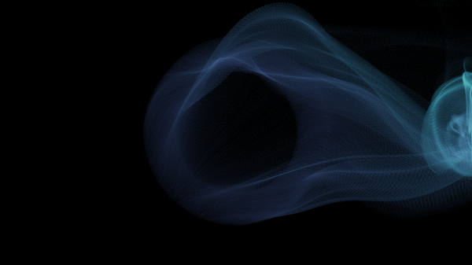
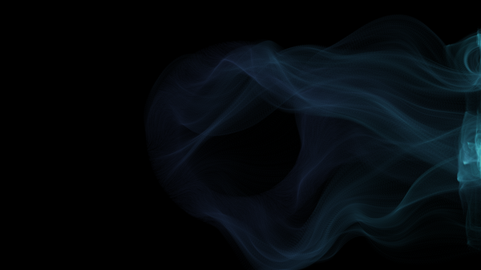

# Gallery

Below are example renders produced with `astonish.py`. Thumbnails link to the full-resolution images in the `outputs/` folder.

To view the images locally, open the files in `outputs/`.

If you rebuild the images yourself, place them in `outputs/` and they will be available from the site when served.
